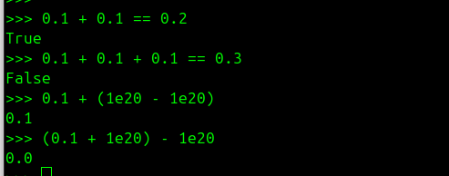
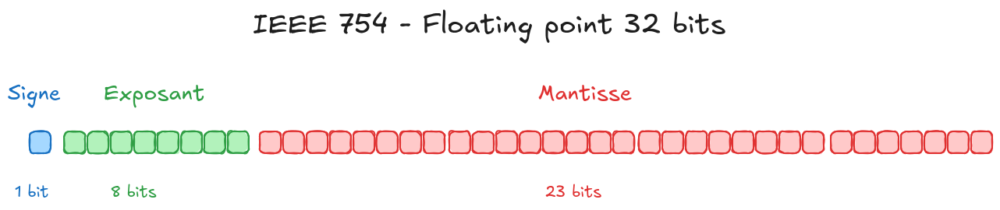

# Le bug : 0.1 + 0.1 +0.1 != 0.3
Testons en python quelques calculs basiques:
- Vérifions que `0.1 + 0.1` est égal à `0.2`
- Que `0.1 + 0.1 + 0.1 = 0.3`
- Ou encore que l'on peut changer l'ordre des calculs dans une addition (que l'addition est bien commutative)

[](bug-fp-python.png)
C'est le drame ! Quand on teste, on a `0.1 + 0.1 = 0.2` mais par contre` 0.1 + 0.1 + 0.1 != 0.3`.
On a `0.1 + (1e20 - 1e20) = 0.1` mais par contre `(0.1 + 1e20) - 1e20 = 0.0`. 

Un bug de Python ? Un problème dans le code. Non, c'est lié à la représentation des nombres. 
Explorons comment les machines stockent les nombres !

# Base 10 vs Base 2
Commençons par la base…
Nous utilisons le système décimal (`base 10`) au quotidien, avec 10 chiffres (`0` à `9`). En informatique, on utilise le binaire (`base 2`), avec seulement deux chiffres : `0` et `1`.
Chaque position dans un nombre binaire représente une puissance de 2, similaire à comment chaque position dans un nombre décimal représente une puissance de 10.
Par exemple, dans notre système décimal `123.45` correspond en fait à :

    1 × 10² + 2 × 10¹ + 3 × 10⁰ + 4 × 10⁻¹ + 5 × 10⁻²

En binaire, le nombre `1101.101` correspond à :
    
    1 × 2³ + 1 × 2² + 0 × 2¹ + 1 x 2⁰ + 1 x 2⁻¹ + 0 * 2⁻² + 1 x 2⁻³


## Représentation d'un nombre entier en base 2
En binaire, les nombres entiers sont représentés en utilisant des bits (`0` et `1`). Par exemple, le nombre décimal 13 s'écrit en binaire comme `1101` :
    
    - 1 × 2³ + 1 × 2² + 0 × 2¹ + 1 × 2⁰ = 8 + 4 + 0 + 1 = 13

Si on regarde en python, ce que cela donne :
```python
>>> bin(13)
'0b1101'
```

# Dtype
En Python, les nombres à virgule flottante sont représentés en utilisant le type `float`, qui correspond à un format de nombre à virgule flottante en double précision (64 bits) selon la norme `IEEE 754`.
Cependant, pour des applications nécessitant une gestion plus précise des nombres décimaux, Python offre également le module `decimal` qui permet de travailler avec des nombres décimaux en utilisant une représentation en base 10.

Dans le domaine de l'IA, on est amené à utiliser d'autres formats de données pour optimiser par exemple la taille mémoire. On accepte une légère perte en précision pour un gain en mémoire et en vitesse de calcul. On va alors utiliser des data types ou `dtypes` comme :
- `float32` sur 32 bits
- `float16` sur 16 bits
- `bfloat16` sur 16 bits
- `fp8` sur 8 bits
- `fp4` sur 4 bits
- `mxfp4` sur 4 bits
- `nvfp4` sur 4 bits

# IEEE754
La norme `IEEE 754` définit la représentation des nombres à virgule flottante en informatique. Un nombre à virgule flottante est représenté par trois composants principaux :
- Le `signe` (1 bit) : indique si le nombre est positif ou négatif.
- L'`exposant` (8 bits pour float32, 11 bits pour float64)
- La `mantisse` ou fraction (23 bits pour float32, 52 bits pour float64)

C'est un standard et on a donc toujours la même représentation quelque soit le langage sous-jacent. Un float32 sera représenté de la même manière en C ou en Python.
[](IEEE754-fp32.png)

Par exemple, pour un nombre en format float32 (32 bits) :
- `1 bit` pour le signe
- `8 bits` pour l'exposant
- `23 bits` pour la mantisse

    [ S ] [     Exponent (8 bits)     ] [             Mantissa (23 bits)            ]
      0            01111111                       10100000000000000000000            


La valeur du nombre s'obtient avec la formule

    valeur = (-1)^signe * 1.mantisse * 2^(exposant -biais)

Détaillons cette formule pour mieux la comprendre. Dans les exemples suivants je vais m'appuyer sur `float32`, mais le même raisonement peut s'appliquer sur `float64`, ou `fp8` par exemple.

## Le signe
On veut pouvoir représenter des nombres négatifs ou positifs, comme `3.14` ou `-0.123`.
Le bit de signe détermine si le nombre est positif ou négatif. Si le bit de signe est `0`, le nombre est positif ; s'il est `1`, le nombre est négatif.

## L'exposant
Notre objectif est de pouvoir représenter aussi bien de très grand nombres que des tous petits. Pour cela, le standard `IEEE754` s'appuie sur la notation scientifique.
En notation scientifique et en `base 10`, on représente un nombre sous la forme

    valeur = mantisse * 10^exposant
    avec mantisse sous la forme 1.xxx

Exemples:

    3.14 = 3.14 * 10^0
    0.00314 = 3.14 * 10^-3
    3140 = 3.14 * 10^3

En base 2, on utilise la même approche, mais avec des puissances de 2 :

    valeur = mantisse * 2^exposant
    avec mantisse sous la forme 1.xxx

Comme on veut représenter des nombres grands comme petits, l'exposant peut prendre des valeurs négatives comme positives. Dans le cas du `float32`, on a vu que l'exposant est stocké sur 8 bits.
En binaire, on a donc un exposant dont la représentation varie de `00000000` à `11111111` soit `2^8 = 256` valeurs possibles.
Et on va avec ces valeurs représenter un exposant qui va varier entre `-127` et `+128` (note : les valeurs `-127` et `+128` sont des cas réservés qui seront décrits plus loin).
La question qui se pose est donc comment faire l'association entre les intervalles [`00000000`, `11111111`] et [`-127`,`128`].
Pour cela, on utilise un biais (bias) de 127. Cela signifie que pour obtenir la valeur réelle de l'exposant, on soustrait 127 à la valeur stockée.
Par exemple, si l'exposant stocké est `10000011 = 2^7 + 2 + 1 = 131`, alors le "vrai" exposant est `131 - 127 = 4`.

La règle générale pour obtenir le biais est donc:

    biais = 2^(nombre_de_bits_exposant - 1) - 1

Pour float32, avec 8 bits pour l'exposant, on a:

    biais = 2^(8-1) - 1 = 127

## La mantisse
La mantisse (ou fraction) représente la partie significative du nombre. En format `float32`, elle est stockée sur 23 bits. Mais ces 23 bits permettent de représenter une information de 24 bits ! En effet, on sait que la mantisse est toujours de la forme `1.xxx`, on n'a donc pas besoin de stocker le `1.`. Ce `1.`est toujours là, donc dans les bits de la mantisse on ne stocke que les valeurs après le point.
Par exemple, si la mantisse stockée est `10010010000111111011011`, cela correspond en réalité à `1.10010010000111111011011` en binaire.

## Notation
Pour définir un format de type `IEEE754`, on a souvent qu'une notation simplifée donnant l'exposant et la mantisse. Par exemple pour du `fp8` on peut dire que c'est du:
- `E4M3` : on aura un exposant sur 4 bits et une mantisse sur 3
- `E5M2` : l'exposant est sur 5 bits et la mantisse sur 2

## Cas particulier
### Zéro
Le lecteur affuté va se demander mais comment représenter le nombre `0`avec ce format ? C'est impossible, puisqu'on part d'une mantisse sous la forme `1.x` et qu'on la multiplie par `1` ou `-1` suivant le signe et par `2^exposant`.
Pour représenter le nombre 0, on utilise une convention spéciale : on définit que lorsque l'exposant et la mantisse sont tous deux égaux à zéro, le nombre représenté est `0` (positif ou négatif selon le bit de signe).
Et oui, on a deux nombres `0`! Le `+0` et le `-0` !

### Infinité
De la même manière, on utilise une convention spéciale pour représenter l'infini. Lorsque l'exposant est au maximum (tous les bits à `1`) et que la mantisse est nulle, le nombre représenté est l'infini (positif ou négatif selon le bit de signe).

### NaN
NaN signifie "`Not a Number`" (Pas un nombre). C'est une valeur spéciale utilisée quand on a des problèmes de calculs. `NaN (Not a Number)` apparaît lorsqu'une opération n’a pas de sens numérique en arithmétique réelle (ex : 0/0, ∞−∞, etc.).

Par convention, on a un `NaN` quand l'exposant est au maximum (tous les bits à 1) et que la mantisse est non nulle.

# Conversion
Pour convertir un nombre décimal en sa représentation binaire en virgule flottante selon la norme `IEEE 754`, on suit les étapes suivantes :

1. Déterminer le signe : `0` pour positif, `1` pour négatif.
2. Convertir la partie entière et la partie fractionnaire du nombre en binaire.
3. Normaliser le nombre binaire pour obtenir la mantisse sous la forme `1.x`
4. Calculer l'exposant en ajustant avec le biais.
5. Assembler le signe, l'exposant et la mantisse pour obtenir la représentation

## Exemple 1
Commençons par un exemple simple avec le nombre `1.625`

1. Signe : `1.625` est positif, donc le bit de signe est `0`.
2. Conversion en binaire : La partie entière `1` est `1` en binaire
    La partie fractionnaire 0.625 est `0.101` car `0.625 = 1/2 + 1/8 = 1 * 2^-1 + 0 * 2^-2 + 1* 2^-3`
    Donc, 1.625 en binaire est `1.101`
3. La partie entière est `1 * 2^0`. L'exposant réel est 0, et on va stocker `exposant_reel + biais` soit la valeur `0 + 127`. En binaire cela donne `01111111`
4. La mantisse est `1.101`, on enlève le `1.`, il reste `101` et on complète avec des zéros pour obtenir 23 bits : `10100000000000000000000`
5. Assemblage : On combine le bit de signe, l'exposant et la mantisse
    - Signe : `0`
    - Exposant : `01111111`
    - Mantisse : `10100000000000000000000`
    - Représentation finale en binaire : `0 01111111 10100000000000000000000`

## Exemple 2
Prenons un autre exemple avec le nombre `-12.345`
1. Signe : `-12.345` est négatif, donc le bit de signe est `1`.
2. Conversion en binaire
Pour la partie entière

    12/2 = 6 reste R=0
    6/2 = 3 reste R=0
    3/2 = 1 reste R=1
    1/2 = 0 reste R=1

On lit les restes à l'envers, donc `12 = 1100` en binaire

Pour la partie fractionnaire

    0.345*2 = 0.690 entier E=0
    0.690*2 = 1.380 entier E=1
    0.380*2 = 0.760 entier E=0
    0.760*2 = 1.520 entier E=1
    0.520*2 = 1.040 entier E=1
    0.040*2 = 0.080 entier E=0
    0.080*2 = 0.160 entier E=0
    0.160*2 = 0.320 entier E=0
    0.320*2 = 0.640 entier E=0
    0.640*2 = 1.280 entier E=1

On arrête ici, mais on doit continuer jusqu'à obtenir nos 23 bits de la mantisse.
En lisant les entiers E dans l'ordre, on obtient `0.0101011100...`
Donc, `-12.345` en binaire est `1100.0101011100...`
3. Normalisation
On déplace la virgule de `3` positions vers la gauche pour obtenir `1.1000101011100... × 2^3`
L'exposant réel est `3`, et on va stocker `exposant_reel + biais = 3 +127 = 130` soit `10000010` en binaire.
4. Mantisse
On enlève le `1.` de la mantisse normalisée et on stocke le reste soit `1000101011100...`
5. Le résultat final (avec le calcul de la mantisse complet) donne:
    - Signe : `1`
    - Exposant : `10000010`
    - Mantisse : `10001011000010100011111` (arrondi à 23 bits)
    - Représentation finale en binaire : `1 10000010 10001010111000010100011`

# Limitations
Les nombres à virgule flottante ont des limitations en termes de précision et de gamme. Par exemple, certains nombres décimaux ne peuvent pas être représentés exactement en binaire, ce qui peut entraîner des erreurs d'arrondi dans les calculs.
Par exemple, le nombre décimal `0.1` n'a pas de représentation binaire exacte.

Si on redéroule l'algorithme présenté au-dessus pour le nombre `0.1` on va arriver à une répétition cyclique de chiffres pour la mantisse. On a le pattern `1001` qui se répète à l'infini. Et bien sûr, nous on a une taille mémoire finie. En `float32` on va stocker ce cycle sur 23 bits et en `float64` sur 52 bits. On sera plus précis mais toujours pas exact.
C'est le même problème en `base 10` quand on essai de représenter `1/3 = 0.3333333`. On ne peut pas stocker la valeur exacte avec une séquence de bits.
En `float32`, la représentation binaire de `0.1` est :

    `0 01111011 10011001100110011001101`

Ce qui correspond en décimal à `0.10000000149011612`, et nous donne une petite erreur d'arrondi.

Cela peut entraîner des résultats inattendus dans les calculs. Par exemple :

```python
>>> 0.1 + 0.1 + 0.1 - 0.3
5.5511151231257827e-17
```
Ou encore
```python
>>> 1.1 + 2.2
3.3000000000000003
```


# Pour aller plus loin
## Decimal vs Binary floating point
Python propose le module `Decimal`, pour des calculs qui respectent l'arithmétique en base 10. On n'a plus d'erreurs de précisions, mais cela se fait au détriment de la taille du stockage et de la vitesse de calcul.

```python
from decimal import Decimal

print(0.1 + 0.1 + 0.1)
print(Decimal("0.1") + Decimal("0.1") + Decimal("0.1"))
```

    0.30000000000000004
    0.3


Un exemple typique serait pour des calculs financiers où on veut absolument éviter des erreurs d'arrondis.
[https://docs.python.org/3/library/decimal.html#module-decimal](https://docs.python.org/3/library/decimal.html#module-decimal)


# Ressources
- Python floating point [https://docs.python.org/3/tutorial/floatingpoint.html](https://docs.python.org/3/tutorial/floatingpoint.html)
- Numpy : [https://numpy.org/doc/stable/user/basics.types.html](https://numpy.org/doc/stable/user/basics.types.html)
- Utilisation de FP8 dans Deepseek [https://arxiv.org/pdf/2505.09343](https://arxiv.org/pdf/2505.09343)

