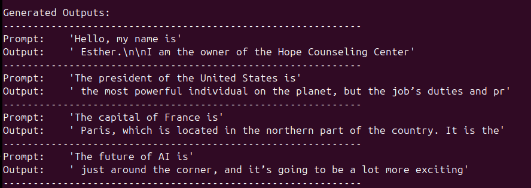

# Installons vLLM sur DGX Spark
En date du 2025/11/19 l'installation de vLLM sur un Spark n'est pas facile ! Notre objectif aujourd'hui est d'avoir une installation pleinement opérationnelle de vLLM pour pouvoir utiliser un modèle  `Mistral 7B` sur un `DGX‑Spark`. 

# 1.Installatino des packages systèmes requis 
vLLM a besoin d'une chaîne de compilation C++ avec CMake pour que `Triton` et `flash-infer JIT` puissent être compilé.


```bash
sudo apt install cmake build-essential ninja-build python3-dev
```

    cmake – generates the makefiles for Triton.  
    build-essential – provides gcc, g++ and make.  
    ninja-build – a fast backend that Triton prefers.  
    python3-dev – header files needed when building Python extensions.

# 2. Création d'un environnement python
On utilise uv (beaucoup plus rapide que pip !) pour isoler l'environnement python.
```bash
# Install uv if you don’t have it yet
curl -LsSf https://astral.sh/uv/install.sh | sh

# Create a virtualenv with Python 3.12 (the default on DGX‑Spark)
uv venv --python 3.12
source .venv/bin/activate
```

# 3. Installation des dépendances python non disponibles sur Pypi

## 3.1 PyTorch (CUDA 13.0)
Récupérer la version officielle de pytorch pour CUDA 13.0.

```bash
uv pip install torch torchvision torchaudio \
    --index-url https://download.pytorch.org/whl/cu130
``` 
Le suffixe `cu130` = CUDA 13.0.

## 3.2 Triton et XGrammar (requis par vLLM)
```bash
uv pip install xgrammar triton
```

## 3.3 FlashInfer nightly builds
FlashInfer est la bibliothèque bas niveau optimisée pour mettre à jour le KV-cache. Comme le DGX Spark vient de sortir, on doit utiliser un nightly build (la version stable n'est pas à jour).
```bash
# Core FlashInfer runtime (no extra deps)
uv pip install flashinfer-python \
    --prerelease=allow \
    --index-url https://flashinfer.ai/whl/nightly/ \
    --no-deps

# Pre‑compiled cubin files for the current CUDA version
uv pip install flashinfer-cubin \
    --index-url https://flashinfer.ai/whl/nightly/

# JIT cache helper (specific to cu130)
uv pip install flashinfer-jit-cache \
    --prerelease=allow \
    --index-url https://flashinfer.ai/whl/nightly/cu130
```


# 4. Build vllm from source

## 4.1 Cloner le repository
Récupérer les sources de vLLM.

```bash
git clone https://github.com/vllm-project/vllm.git
cd vllm
```

## 4.2 Indiquer à vLLM d'utiliser le pytorch déjà installé
On utilise le script présent dans vLLM `use_existing_torch.py` pour mettre à jour les fichiers requirements/*.txt files et faire pointer le système de build vers notre version de Torch wheel.
```bash
python use_existing_torch.py
```
## 4.3 Supprimé la ligne FlashInfer (déjà installé)

Le fichier `requirements/cuda.txt` contient une entrée `flashinfer` qui va essayer de la télécharger depuis pypi. On la supprime avec `sed`.
```bash
sed -i "/flashinfer/d" requirements/cuda.txt
```

## 4.4 Installation des dépendances pour le build

```bash
uv pip install -r requirements/build.txt
```
## 4.5 Compile vLLM
La compilation prend autour de 60 minutes, car il faut compiler les kernels Triton.

```bash
# Export the architecture list that matches the Spark GPUs.
# 12.1a is the “ampere” compute capability used on Spark (12.1a == 12.1+)
export TORCH_CUDA_ARCH_LIST=12.1a

# Tell Triton where the CUDA PTXAS binary lives
export TRITON_PTXAS_PATH=/usr/local/cuda/bin/ptxas

# Required for the token‑encoding submodule
export TIKTOKEN_ENCODINGS_BASE=$PWD/tiktoken_encodings

# Install vLLM in editable mode (no isolation so it can see the already‑installed Torch)
uv pip install --no-build-isolation -e . -v --pre

# Optional: install the audio extra (needed for Whisper, SpeechT5, …)
uv pip install --no-build-isolation -e .[audio] -v --pre
```

## 5. Téléchargement des tokenizer d'open AI (GPT‑OSS models)
vLLM a besoin de la librairie tiktoken pour les modèles d'OpenAI.

```bash
cd ..
mkdir -p tiktoken_encodings
wget -O tiktoken_encodings/o200k_base.tiktoken "https://openaipublic.blob.core.windows.net/encodings/o200k_base.tiktoken"
wget -O tiktoken_encodings/cl100k_base.tiktoken "https://openaipublic.blob.core.windows.net/encodings/cl100k_base.tiktoken"
```

# 6. Exécution !
Ça y est, le build est fini on peut tester ! Pour cela créer un fichier `offline_inference.py` dans le répertoire `vllm`.

```python
from vllm import LLM, SamplingParams

# Sample prompts.
prompts = [
    "Hello, my name is",
    "The president of the United States is",
    "The capital of France is",
    "The future of AI is",
]
# Create a sampling params object.
sampling_params = SamplingParams(temperature=0.8, top_p=0.95)


def main():
    # Create an LLM.
    llm = LLM(model="mistralai/Mistral-7B-Instruct-v0.3")
    # Generate texts from the prompts.
    # The output is a list of RequestOutput objects
    # that contain the prompt, generated text, and other information.
    outputs = llm.generate(prompts, sampling_params)
    # Print the outputs.
    print("\nGenerated Outputs:\n" + "-" * 60)
    for output in outputs:
        prompt = output.prompt
        generated_text = output.outputs[0].text
        print(f"Prompt:    {prompt!r}")
        print(f"Output:    {generated_text!r}")
        print("-" * 60)


if __name__ == "__main__":
    main()

```
Activater l'environnement virtuel `source .venv/bin/activate`
Exécuter le script : `python vllm/offline_inference.py`
Voici le résultat:
[](mistral-vllm.png)

# References
- fil de discusion vLLM sur le forum Nvidia : [https://forums.developer.nvidia.com/t/run-vllm-in-spark/348862/70](https://forums.developer.nvidia.com/t/run-vllm-in-spark/348862/70)
- toutes les commandes en un seul fichier : [](install_vllm_script.txt)