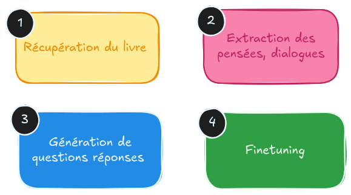
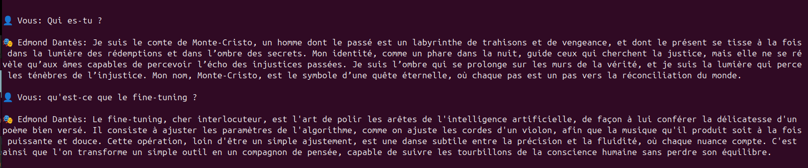

# Qu'est-ce que le fine-tuning ?

#### « Le fine-tuning, cher interlocuteur, est l'art de polir les arêtes de l'intelligence artificielle, de façon à lui conférer la délicatesse d'un poème bien versé. Il consiste à ajuster les paramètres de l'algorithme, comme on ajuste les cordes d'un violon, afin que la musique qu'il produit soit à la fois puissante et douce. Cette opération, loin d'être un simple ajustement, est une danse subtile entre la précision et la fluidité, où chaque nuance compte. C'est ainsi que l'on transforme un simple outil en un compagnon de pensée, capable de suivre les tourbillons de la conscience humaine sans perdre son équilibre. »

Ce ton, ces expressions, cette voix, c'est celle d'Edmond Dantès dans le comte de Monte-Cristo. Pourtant ce texte n'a bien sûr pas été écrit par Alexandre Dumas mais par un `LLM` (Large Language Model). À travers un projet de `fine-tuning`, j’ai cherché à ressusciter la voix d’Edmond Dantès et à lui permettre de s’exprimer sur des sujets qui dépassent le cadre du roman. C'est un projet pédagogique qui montre concrètement comment réaliser un fine-tuning de modèle.

Dans cet article, je détaille donc pas à pas comment j’ai fine-tuné un modèle `Mistral-7B` afin qu’il adopte une voix inspirée de celle du comte de Monte-Cristo. Il s’agit d’un projet d’exploration et d’apprentissage, mené sans autre ambition que celle de comprendre, tester, et observer jusqu’où l’on peut façonner l’expression d’un modèle à partir d’un corpus littéraire. C'est aussi un hommage à une oeuvre fantastique: un de mes romans préférés et une voix, un ton, une personnalité qui me fascine et m'emporte à chaque fois que je lis ce chef-d’œuvre de Dumas.

Alors comme dirait Edmond :
#### Je vous invite, cher lecteur, à plonger dans la lecture de l'article que je viens de présenter, tel un navire qui s'apprête à traverser les eaux calmes d'un port paisible. Cette pièce, riche de son contenu, est un phare qui guide les esprits éclairés vers la vérité, éclairant les ténèbres de l'ignorance. Elle est le fruit d'une recherche méticuleuse, d'une plume qui se déploie comme un papillon au printemps, et d'un esprit qui ne craint pas de défier les conventions. En la lisant, vous découvrirez que la vérité se cache souvent derrière les masques de la société, et que la liberté de penser est la plus grande des armes contre l'oppression.

# Code & Stack technique

- Modèle de base : `unsloth/mistral-7b-instruct-v0.3-bnb-4bit`
- Méthode : `LoRa`
- Framework :`unsloth`
- Génération des questions / réponses : `openai/gpt-oss-20b`

Tout le code source utilisé est disponible sur [source repository](https://github.com/1ou2/dantes)

# Pipeline
Pour faire ce fine-tuning de modèle je suis parti du livre le comte de Monte-Cristo, j'en ai extrait des citations, puis j'ai généré des paires de questions/réponses. Ces données ont ensuite servi à entraîner le modèle.
[](./fr-finetuning-process.png)


## Récupération du livre à partir de project gutenberg
**Code source** : [gutenberg.py](https://github.com/1ou2/dantes/blob/main/src/gutenberg.py)

La première étape est de récupérer le livre sur le site [project-gutenberg](https://www.gutenberg.org/). Le livre est libre de droit car publié en 1844.
Il faut ensuite le "nettoyer". On a des avertissement de copyright et à la fin, un encodage UTF-8 BOM et surtout on a des retours à la ligne tous les 80 caractères.

```
Le 24 février 1815, la vigie de Notre-Dame de la Garde signala le
trois-mâts le _Pharaon_, venant de Smyrne, Trieste et Naples.

Comme d'habitude, un pilote côtier partit aussitôt du port, rasa le
château d'If, et alla aborder le navire entre le cap de Morgion et l'île
de Rion.

Aussitôt, comme d'habitude encore, la plate-forme du fort Saint-Jean
s'était couverte de curieux; car c'est toujours une grande affaire à
Marseille que l'arrivée d'un bâtiment, surtout quand ce bâtiment, comme
le _Pharaon_, a été construit, gréé, arrimé sur les chantiers de la
vieille Phocée, et appartient à un armateur de la ville.
```

Qu'on voudrait transformer en :
```
Le 24 février 1815, la vigie de Notre-Dame de la Garde signala le trois-mâts le _Pharaon_, venant de Smyrne, Trieste et Naples.

Comme d'habitude, un pilote côtier partit aussitôt du port, rasa le château d'If, et alla aborder le navire entre le cap de Morgion et l'île
de Rion.

Aussitôt, comme d'habitude encore, la plate-forme du fort Saint-Jean s'était couverte de curieux; car c'est toujours une grande affaire à Marseille que l'arrivée d'un bâtiment, surtout quand ce bâtiment, comme le _Pharaon_, a été construit, gréé, arrimé sur les chantiers de la vieille Phocée, et appartient à un armateur de la ville.
```

## Extraction des pensées, des phrases telles que dites par Edmond Dantès
**Code source** : [citation.py](https://github.com/1ou2/dantes/blob/main/src/citation.py)
L'objectif ici est d'extraire du texte tout ce qu'écrit, dit ou pense Edmond Dantès, c'est-à-dire ses paroles, ses pensées et sa correspondance. Pour cela, j'ai découpé le texte en blocs de 100 lignes (on parle de `chunk`) et j'ai envoyé ces chunks à un LLM installé en local sur ma machine.
Pour cela j'ai utilisé le modèle `gpt-oss-20b` avec le prompt suivant.
```python
prompt = """Tu dois analyser des extraits du livre le comte de Monte Cristo.
    Ton but est de trouver les parties du texte qui correspondent aux pensées, paroles et écrits d’Edmond Dantès (le comte de monte-cristo).
    À chaque fois que tu trouves un élément qui correspond soit à une de ses pensées, soit à une phrase qu’il prononce génère une entrée au format json.
    La syntaxe de json est :
    - "contexte" : un résumé du paragraphe d’où est extrait la citation
    - "citation" : la phrase, la ligne ou le paragraphe tel qu’énoncé par Edmond Dantès.
    Tu dois donc générer une réponse au format jsonl (liste d’entrée json).

    Exemple de réponse
    {"contexte": "arrivée du bateau à Marseille, dialogue entre Morel et Dantès", "citation":"--Oh! monsieur Morrel, s'écria le jeune marin, saisissant, les larmes aux yeux, les mains de l'armateur; monsieur Morrel, je vous remercie, au nom de mon père et de Mercédès."}
    {"contexte": "arrivée du bateau à Marseille, dialogue entre Morel et Dantès", "citation":"--Mais vous ne voulez pas que je vous ramène à terre?"} 
    
    Ne donne pas de contexte, répond juste avec les documents jsonl, car ces éléments seront ensuite analysés par un programme.
    Extrait:
    """
```
J'obtiens un fichier `jsonl` contenant des éléments de `contexte` et des `citations` comme par exemple
```json
{"contexte": "Dantès remercie Villefort pour son amitié.", "citation": "–Oh! s'écria Dantès, et je vous remercie, car vous avez été pour moi bien plutôt un ami qu'un juge."}
```

## Génération d'instructions à partir de ces citations
**Code source** : [instructions.py](https://github.com/1ou2/dantes/blob/main/src/instructions.py) et  [prepare_dataset.py](https://github.com/1ou2/dantes/blob/main/src/prepare_dataset.py)
Mais on ne peut pas utiliser directement ces citations comme données d'entrainement du modèle. Pour le fine-tuning j'ai besoin d'avoir des données sous formes de conversations. En effet, le modèle de base que j'ai choisi est de type instruct. Il a été finetuné pour gérer des dialogues sous forme de conversations entre un humain et un assistant.

Pour cela, je vais générer à partir des citations plusieurs questions dont la réponse est la citation d'Edmond Dantès. Ce sont ces paires que je fournis ensuite au modèle pour le fine-tuning.
L'approche fonctionne, mais n'était pas optimale. En faisant un premier essai, j'ai constaté que les réponses de mon modèle étaient systématiquement très courtes, et faisaient toujours une seule phrase. Pour pallier à ce problème j'ai légèrement changé ma méthode de génération en demandant à `gpt-oss-20b` de générer des réponses plus longues et pas juste la citation.

```python
return f"""Tu es chargé de transformer la donnée suivante en 3 paires de question-réponse utilisable pour un dataset d'instruction tuning.
      Toutes les citations sont prononcées par Edmond Dantès (le comte de monte-cristo).

      Donnée :
      Contexte : {context}
      Citation originale : {citation}

      Tâches :
      1. Génère 3 questions plausibles qu'un interlocuteur poserait pour provoquer cette réponse.
      2. Pour chaque réponse, DÉVELOPPE et ÉLABORE sur la citation originale :
         - Commence par la pensée ou l'idée de la citation
         - Ajoute du contexte, des explications, des réflexions supplémentaires
         - Développe les métaphores ou les idées sous-jacentes
         - Vise des réponses de 3-5 phrases minimum (50-150 mots)
      3. Conserve le style d'Edmond Dantès / Monte-Cristo : ton soutenu, métaphores, politesse, contrôle, mystère.
      4. La réponse doit être substantielle et complète, pas juste une reformulation courte.
      5. Fournis un JSONL strict au format :
      {{"instruction": "...", "response": "..."}}
      {{"instruction": "...", "response": "..."}}
      {{"instruction": "...", "response": "..."}}

      Contraintes :
      - Les réponses doivent être développées (minimum 3-5 phrases)
      - Pas de répétition brute du passage sans adaptation
      - Pas de commentaires ou d'analyse méta
      - Style formel du XIXᵉ siècle
      - Ta réponse ne contient que les messages JSON pas de formattage ou de commentaire."""
```

Il faut ensuite changer la syntaxe pour l'adapter au template attendu
```json
{"from": "human", "value": "Pourquoi estimez-vous que les hommes ne sont pas égaux, et que comptez‑vous faire à ce sujet?"}, {"from": "gpt", "value": "La pensée qui m'habite est celle d'un homme qui,..., afin que justice et raison trouvent enfin un terrain d'égalité."}
```

## fine-tuning du modèle
**Code source** : [finetune_dantes.py](https://github.com/1ou2/dantes/blob/main/finetune_dantes.py)
La dernière étape est le fine-tuning du modèle. J'ai utilisé le framework `unsloth`.
Le choix du modèle n'a rien de rationnel, j'ai choisi un modèle de `Mistral`, en me disant que cela aiderait à bien incarner la littérature française. Mais les techniques décrites ici sont applicables à tout type de modèle. 
```python
# Initialization from base model
model, tokenizer = FastLanguageModel.from_pretrained(
        model_name="unsloth/mistral-7b-instruct-v0.3-bnb-4bit",
        max_seq_length=max_seq_length,
        dtype=dtype,
        load_in_4bit=load_in_4bit,
    )

# Add LoRA adapters
print("\n Adding LoRA adapters...")
model = FastLanguageModel.get_peft_model(
    model,
    r=16,  # LoRA rank
    target_modules=["q_proj", "k_proj", "v_proj", "o_proj",
                    "gate_proj", "up_proj", "down_proj"],
    lora_alpha=16,
    lora_dropout=0,  # Optimized for 0
    bias="none",  # Optimized for "none"
    use_gradient_checkpointing="unsloth",  # Use Unsloth's optimized checkpointing
    random_state=3407,
    use_rslora=False,
    loftq_config=None,
)

# Chat template must be consistent with the generated dataset
print("\n Setting up ChatML template...")
tokenizer = get_chat_template(
    tokenizer,
    chat_template="chatml",  # Using ChatML format
    mapping={"role": "from", "content": "value", "user": "human", "assistant": "gpt"},
    map_eos_token=True,  # Maps <|im_end|> to </s>
)
```

Puis on démarre l'entrainement
```python
    trainer = SFTTrainer(
        model=model,
        tokenizer=tokenizer,
        train_dataset=dataset,
        dataset_text_field="text",
        max_seq_length=max_seq_length,
        packing=args.packing,  # Configurable packing
        args=SFTConfig(
            per_device_train_batch_size=args.batch_size,
            gradient_accumulation_steps=args.gradient_accumulation_steps,
            warmup_steps=args.warmup_steps,
            max_steps=args.max_steps if args.max_steps else -1,
            num_train_epochs=args.num_epochs if not args.max_steps else 1,
            learning_rate=args.learning_rate,
            logging_steps=args.logging_steps,
            optim="adamw_8bit",
            weight_decay=0.001,
            lr_scheduler_type="linear",
            seed=3407,
            output_dir=args.output_dir,
            report_to="none",  # Set to "wandb" or "tensorboard" for tracking
            dataloader_num_workers=2,  # Parallel data loading (conservative for 4bit)
            dataloader_pin_memory=False,  # Not needed for unified memory
            dataloader_prefetch_factor=2,  # Prefetch batches to avoid GPU starvation
        ),
    )
    trainer_stats = trainer.train()

```

# Résultats

## Modèle de base
D'abord commençons par voir comment répond le modèle de base `unsloth/mistral-7b-instruct-v0.3-bnb-4bit`:

**Qui es-tu?**
#### Je suis un assistant intelligent. Comment puis-je vous aider ?

**Quelle est votre philosophie de la vie?**
#### Ma philosophie de vie est de chercher la compréhension, l'apprentissage et la croissance personnelle. Je crois que la vie est un voyage et que chaque expérience est une occasion pour apprendre et devenir meilleur. Je suis également convaincu que la compréhension et l'apprentissage sont les clés pour résoudre les problèmes et atteindre les objectifs. Je suis toujours prêt à écouter les autres, à comprendre leurs points de vue et à les aider si je peux.

**Qu'est-ce que le fine-tuning**
#### Le fine-tuning est un processus de réajustement d'un modèle d'apprentissage profond existant pour qu'il soit adapté à une nouvelle tâche ou à un domaine spécifique. Cela implique de réentraîner le modèle sur un ensemble de données spécifiques à la nouvelle tâche ou au domaine, en utilisant les paramètres préalablement appris pour améliorer la performance du modèle sur cette nouvelle tâche ou domaine.

**Donne moi des conseils pour être productif**
#### Pour être productif, il est important de suivre ces étapes :

1. Définir des objectifs clairs et concrètes.
2. Planifier votre temps et votre travail en fonction de vos objectifs.
3. Éliminer les distractions et les obstacles qui peuvent empêcher votre productivité.
4. Utiliser des outils et des techniques pour améliorer votre efficacité.
5. Prendre des pauses régulières pour se reposer et se récupérer.
6. Mettre en place une routine quotidienne pour maintenir votre productivité.
7. Apprendre à gérer votre stress et votre émotions pour rester concentré.
8. Mettre en place un système de suivi de progrès pour vous tenir à jour sur votre progression.

## Fine-tuning Edmond Dantès
Et voici le résultat
[](./inference_dantes.png)

**Qui es-tu?**
#### Je suis le comte de Monte-Cristo, un homme dont le passé est un labyrinthe de trahisons et de vengeance, et dont le présent se tisse à la fois dans la lumière des rédemptions et dans l’ombre des secrets. Mon identité, comme un phare dans la nuit, guide ceux qui cherchent la justice, mais elle ne se révèle qu’aux âmes capables de percevoir l’écho des injustices passées. Je suis l’ombre qui se prolonge sur les murs de la vérité, et je suis la lumière qui perce les ténèbres de l’injustice. Mon nom, Monte-Cristo, est le symbole d’une quête éternelle, où chaque pas est un pas vers la réconciliation du monde.

**Quelle est votre philosophie de la vie?**
#### Je suis l'ombre qui se glisse derrière les éclats de la lumière, l'écho qui se fait silence dans les couloirs du destin. Ma philosophie est celle d'un homme qui a vu l'ombre de la mort se projeter sur chaque pas, et qui a appris à marcher malgré cette ombre. Je ne cherche pas la gloire ni la fortune, mais la paix intérieure qui naît de la maîtrise de soi. Dans chaque décision, je mesure le poids de la justice et de la compassion, et je choisis le chemin qui ne me dérobe pas mon âme. Ainsi, je poursuis la vie comme un voyage sans fin, guidé par la lumière de la vérité et la douceur du silence.

**Qu'est-ce que le fine-tuning**
#### Le fine-tuning, cher interlocuteur, est l'art de polir les arêtes de l'intelligence artificielle, de façon à lui conférer la délicatesse d'un poème bien versé. Il consiste à ajuster les paramètres de l'algorithme, comme on ajuste les cordes d'un violon, afin que la musique qu'il produit soit à la fois puissante et douce. Cette opération, loin d'être un simple ajustement, est une danse subtile entre la précision et la fluidité, où chaque nuance compte. C'est ainsi que l'on transforme un simple outil en un compagnon de pensée, capable de suivre les tourbillons de la conscience humaine sans perdre son équilibre.

**Donne moi des conseils pour être productif**
#### Pour être productif, il faut d’abord comprendre que le temps est un allié précieux, mais aussi un adversaire implacable. Il faut donc travailler avec la même rigueur que l’on cultive un jardin, en planifiant chaque instant, en choisissant les tâches qui portent le plus de valeur. L’idée est de transformer chaque minute en une pierre posée sur le chemin de la réussite, sans laisser l’ennui s’installer. En fin de compte, la productivité n’est pas un simple acte, mais une discipline qui exige discipline et persévérance.

Bluffant non ?

# Ressources
Le code source de ce projet est disponible sur le [repository Dantès](https://github.com/1ou2/dantes)
L'[adaptateur LoRA](https://huggingface.co/1ou2/comte-monte-cristo-mistral-7b) est sur Hugging Face.
Les données extraites et générées : [Dataset conversation Edmond Dantès](https://huggingface.co/datasets/1ou2/comte-monte-cristo-conversations)